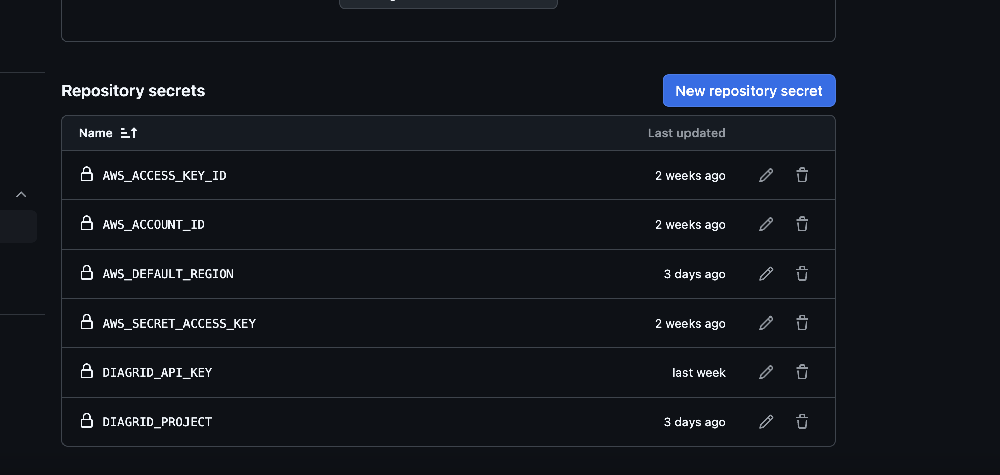
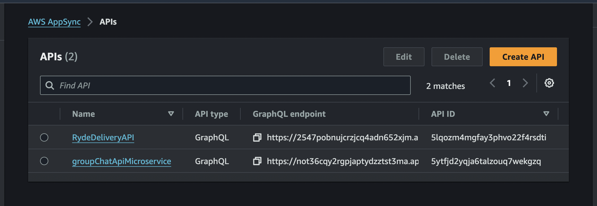
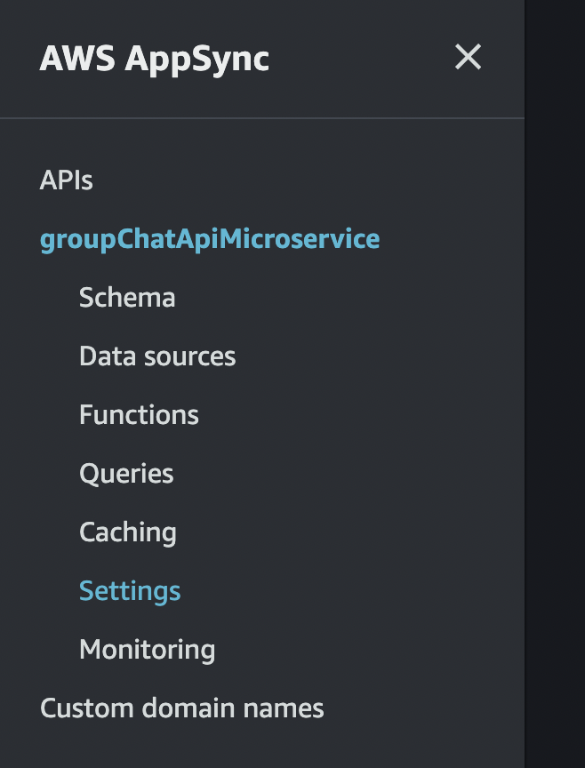
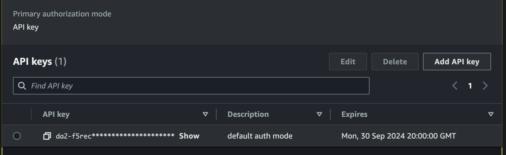
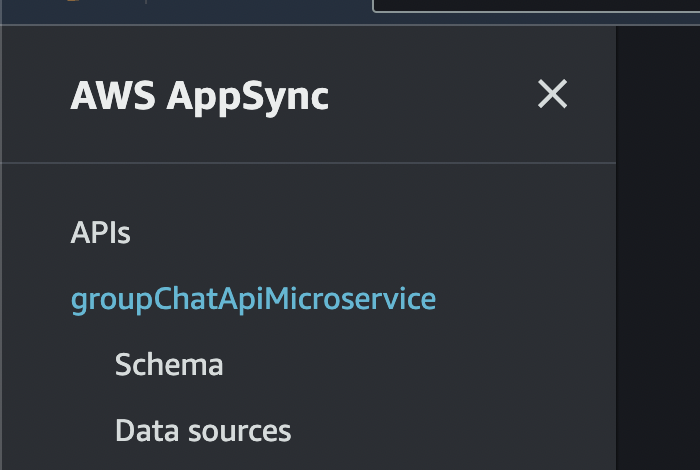

# Create Diagrid(Catalyst) Project And Components

Because this project has 6 services, each service will represent a Catalyst App
Id.

Communication between services will be done through a pubsub connection that
consist of SNS topics and SQS subscriptions. AWS SNS/SQS will be configured on
demand by Catalyst.

Each service will have a state for data storage and for this application, we'll
be using AWS DynamoDB.


## Project Directory Structure

```
|catalyst-reference-apps
|-.github
   |--workflows
|-aws-pubsub
  |--cdk-graphql-stack(`realtime appsync api`)
  |--cdk-infra(`docker-ecr-ecs/fargate`)
  |--docs
  |--group-chat-app-ui
  |--services(Catalyst Apps)
|-group-subs.yaml
|-readme.md
```

The `.github` folder contains a Github Actions pipeline setup to automate the
creation and configuration of this project, alongside all it's components.

The workflow is broken down into 3 jobs.

### setup-diagrid-project

This job

- Creates a new Diagrid Catalyst project called `group-chat-microservices` with
  6 Catalyst apps.
- Configures a Dynamodb state for each Catalyst App. Meaning 6 Dynamodb States.
- Creates a single pubsub (AWS SQS/SNS) for all the states.
- Configures a subscription topic for catalyst apps to publish and subscribe to.

### 2. upload-to-ecs

This job

- Retrieves the Diagrid Project variables such as `apitoken` for each catalyst
  app, and also the `http_url` and `grpc_url` which will be passed in as
  Environment Variables when creating Fargate Tasks for each service in
  ECS(Elastic Container Service).

- Uploads a docker image for each catalyst app(service) to Amazon Elastic
  Container Registry(ECR)
- Installs A CDK project alongside some dependencies

- Creates a VPC(Virtual Private Cloud) configuration with subnets, availability
  zones and VPC Logs for an ECS cluster.
- Configures an Amazon Elastic Container Service(ECS) cluster and uploads each
  ECR image as a Fargate while passing in the with individual Application Load
  Balancers(ALB).
- Gets the Domain Name Service(DNS) for each ALB and adds them as a public
  endpoint to each Catalyst App.

### 3. deploy-graphql-cdk-stack

This job

- Installs CDK and accompanying dependencies.
- Grabs all ALB DNS for each service and passes them as a json file to a CDK
  project.
- Deploys CDK Project and generates an endpoint which can be used to perform
  `query`, `mutation` and `subscription` operations on the underlying data.

The generated endpoint will also be used to configure the group chat apps
frontend amplify application. But we'll talk about this later.

## How to deploy this app

Create a fork of this github repository
https://github.com/diagrid-labs/catalyst-reference-apps/tree/main.

Navigate to the `Settings` menu of your fork. 

Scroll down to the bottom left hand side of the screen and click on
`Secrets and Variables`.


Click on `Actions`.

.

Click on the blue button `New repository secret` and add key-value pairs for
each of these repository secrets.

Do a git push once you're done. If the everything was configured properly, your
workflow should run and all 3 jobs completed successfully.

Now, sign into your aws console, from the search bar, type `appsync`, navigate
to your appsync console.


You'll find a project named `groupChatApiMicroservice`


Click on the project, navigate to settings on the bottom left handside of the
menu and make sure you have a valid api key.




Navigate back to your project's home page by clicking the name of the project in
the left menu. 

Scroll to to the middle of the page and copy the command show in the screenshot
below. It has this format

```bash
npx @aws-amplify/cli codegen add --apiId 5ytfjd2****** --region us-east-1
```

Next, navigate to the directory `group-chat-app-ui`, and run the following
commands

`npm install aws-amplify` `npm i` and the command you copied above.

 Assuming you created an AWS Access
Key/secret in the prerequisites section.

For the Diagrid API_KEY, assuming you've installed and logged into the diagrid
CLI from the command line, run this command

```bash

diagrid apikey create --name [ENTER NAME OF API KEY] --role  cra.diagrid:admin

```

Replace `[ENTER NAME OF API KEY]` with any name of your choice.

For the `DIAGRID_PROJECT` , use this `group-chat-microservices`

- AWS_ACCESS_KEY_ID
- AWS_ACCOUNT_ID
- AWS_DEFAULT_REGION
- AWS_SECRET_ACCESS_KEY
- DIAGRID_API_KEY
- DIAGRID_PROJECT

Clone your fork and open it with any IDE of your choice. Navigate to the
`.github/workflows` folder and you'll find a pipeline with 3 jobs.

The first job creates and configures a diagrid catalyst project.

The second job deploys each catalyst App to ECS/FARGATE, generates endpoints
using the Application Load Balancer and then sets up these endpoints as public
endpoints in your catalyst Apps. Corresponding code is inside the `cdk-infra`
directory.

The third job creates a Appsync API as a single point of entry into your
application, using each generated endpoint as http datasources. Corresponding
code is inside the `cdk-graphql-stack` directory.

## Running Locally

Once cloned and open inside the IDE, run the command `python run.py` ... to be
continued
