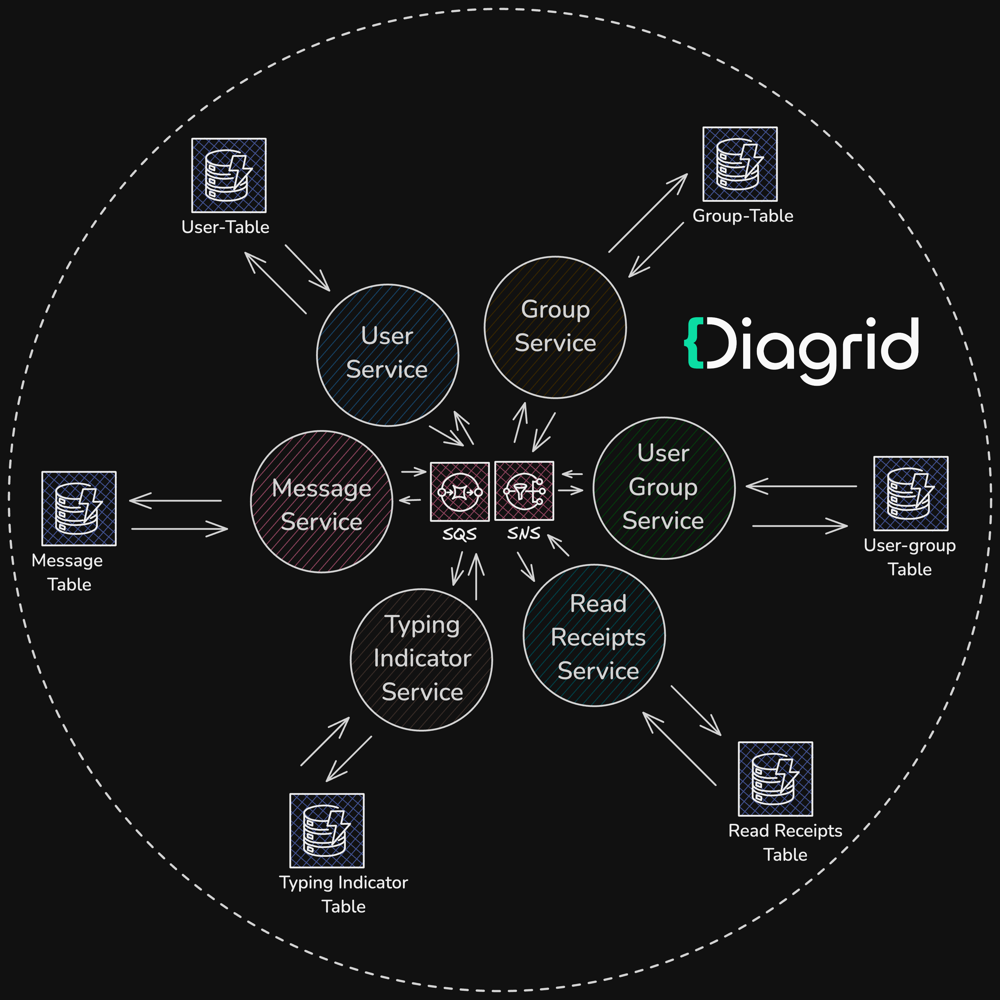
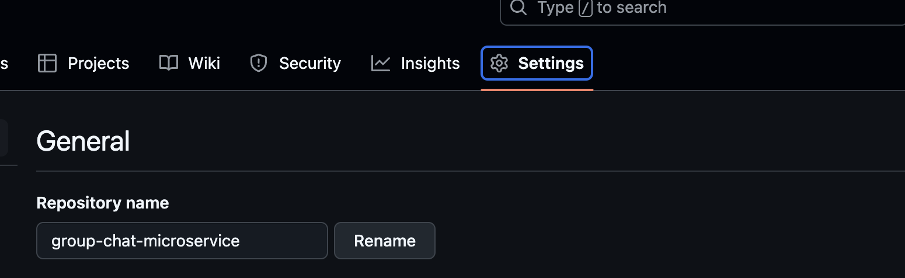
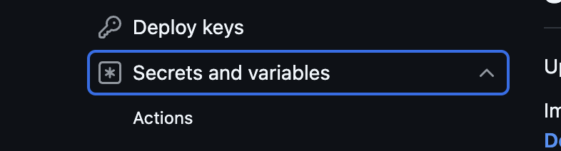
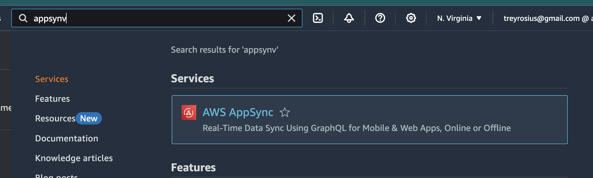

# Prepare and deploy the group chat application solution

The group chat application is comprised of six microservices:

- User service
- Group service
- User group service
- Message service
- Typing indicator service
- Read receipts service

Each microservice will have a corresponding App ID representation in Catalyst.

The services communicate asynchronously through publish-subscribe messaging
using the Catalyst Pub/Sub API. The API is configured to use AWS SNS topics and
AWS SQS subscriptions for the messaging infrastructure. The SNS/SQS topics and
subscriptions are created on-demand by Catalyst, therefore no upfront infra
deployment is required.

In addition, each service is instrumented to use the Catalyst State API for
managing application state. The State API is configured to use AWS Dynamo DB.



## Solution structure

The `.github` folder contains a Github Actions pipeline setup to automate the
creation and configuration of all necessary Catalyst and AWS resources.

```bash
|catalyst-reference-apps
|-.github
   |--workflows
|-aws-pubsub
  |--cdk-graphql-stack(`realtime appsync api`)
  |--cdk-infra(`docker-ecr-ecs/fargate`)
  |--docs
  |--group-chat-app-ui
  |--services(Catalyst Apps)
|-group-subs.yaml
|-readme.md
```

The Github workflow includes three stages:

### 1. configure-diagrid-resources

The first stage of the pipeline deploys everything your application needs to
interact with the Catalyst APIs. This includes:

- Creating six App IDs, one for each microservice in the group chat application
- Creating an AWS Dynamo DB instance and the respective state components for
  each Catalyst App
- Creating an AWS SNS/SQS Pub/Sub component
- Creating Pub/Sub topic subscriptions to ensure the Catalyst apps can publish
  and/or subscribe to messages

### 2. upload-to-ecs

The second stage of the pipeline deploys each application service to AWS Elastic
Container Service using the AWS CDK with the approriate Catalyst environment
variables configured. This includes:

- Retrieving the Catalyst project configuration settings such as:

  - `DAPR_API_TOKEN` for each catalyst app
  - `DAPR_HTTP_ENDPOINT` and `DAPR_GRPC_ENDPOINT`

- Uploading docker images for each service to AWS Elastic Container Registry
  (ECR)

- Installing a CDK project alongside some dependencies

- Creating AWS resources such as:

  - A Virtual Private Cloud (VPC) configuration with subnets, availability zones
    and VPC Logs for an ECS cluster
  - An AWS Elastic Container Service (ECS) cluster
  - Fargate applications with associated Application Load Balancers (ALB)

- Configuring Catalyst App Endpoints by retrieving the ALB endpoints for each
  fargate instance and adding them to their respective Catalyst App IDs.

### 3. deploy-graphql-cdk-stack

The third stage of the pipeline deploys each application service to AWS Elastic
Container Service using the AWS CDK with the approriate Catalyst environment
variables configured. This includes:

- Installs CDK and accompanying dependencies.
- Retrieves the ALB DNS for each service and passes them as a JSON file to a CDK
  project
- Deploys the CDK Project and generates an endpoint which can be used to perform
  `query`, `mutation` and `subscription` operations on the underlying data

The generated endpoint will also be used to configure the frontend amplify
application, which will be covered later on.

## Preparing the pipeline

In order to deploy Catalyst resources from the pipeline, you will need a
Catalyst project & a generated API token.

1. Login to Catalyst

   ```bash
   diagrid login
   ```

1. Set the appropriate Diagrid organization if you have more than one

   ```bash
   diagrid orgs use [your-org-name]
   ```

1. Select a unique project name for your Catalyst project

   ```bash
   export DIAGRID_PROJECT="group-chat-app"
   ```

1. Create a Catalyst project

   ```bash
   diagrid project create $DIAGRID_PROJECT
   ```

1. Create a Catalyst project

   ```bash
   diagrid project use $DIAGRID_PROJECT
   ```

1. Create an API key which can be used by the pipeline when making Catalyst
   management API commands and store in an environment variable

   ```bash
   diagrid apikey create --name catalyst-api-key --role  cra.diagrid:admin
   ```

   ```bash
   export CATALYST_API_KEY=[your-token-value]
   ```

## Deploying the solution

1. Create your own fork of this
   [repo](https://github.com/diagrid-labs/catalyst-reference-apps/tree/main).
1. Navigate to the `Settings` menu within your fork.
   
1. Select `Secrets and Variables` from the left-hand menu.
   
1. Click on `Actions`.
1. Select `New repository secret` and add the following sensitive values:
   - AWS_ACCESS_KEY_ID
   - AWS_SECRET_ACCESS_KEY
   - AWS_ACCOUNT_ID
   - AWS_DEFAULT_REGION
   - DIAGRID_API_KEY
1. Select `new respository variable` and add the following values
   - AWS_DEFAULT_REGION
   - DIAGRID_PROJECT

Once you're ready, run the pipeline. If the everything is configured properly,
your workflow should run to completion successfully.

### Running the Group Chat App UI

Navigate to the folder `group-chat-app-ui` and create a `.env` file at root. The
`.env` file will contain private credentials required to connect the GraphQL API
to the Frontend Application.

Next,

1. Sign in to the AWS console, navigate to the `AWS AppSync` service using the
   search bar. 

2.Click the `groupChatApp` api,and from the menu on the left hand side of the
screen, click `Settings`.

Assuming the `.env` file you created above is still open, if not, open it and
fill in the blank spaces.

```json
NUXT_APPSYNC_GRAPHQL_ENDPOINT=[GRAPHQL_ENDPOINT]
NUXT_APPSYNC_API_KEY=[api-key]
NUXT_APPSYNC_REGION=[Region]
NUXT_APPSYNC_AUTHENTICATION_TYPE=API_KEY

```

The `Graphql endpoint`, `api-key` and `region` are available in the Settings
screen of the appsync api.

From your CLI, navigate to the root of `group-chat-app-ui` and run the commands
below.

`npm i`

`npm run dev`

## Creating and running a diagrid Catalyst app locally

Assuming you created an AWS Access Key/secret in the prerequisites section. Once
cloned and opened inside the IDE.

Setup these environment variables in your CLI.

```
export CONNECTION_ACCESS_KEY=******
export CONNECTION_SECRET_KEY=********8
export AWS_DEFAULT_REGION=****
export AWS_ACCOUNT_ID=2******
export GROUP_CHAT_MICROSERVICES=group-chat-microservices

```

Then run the command `python run.py` to install and configure your diagrid
project and components

> Note: You can run the application locally, using the command `npm run dev` or
> follow this [guide](https://docs.amplify.aws/vue/start/quickstart/) to deploy
> the application to the cloud.
