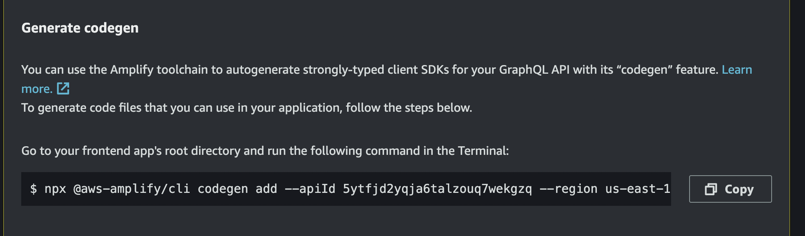
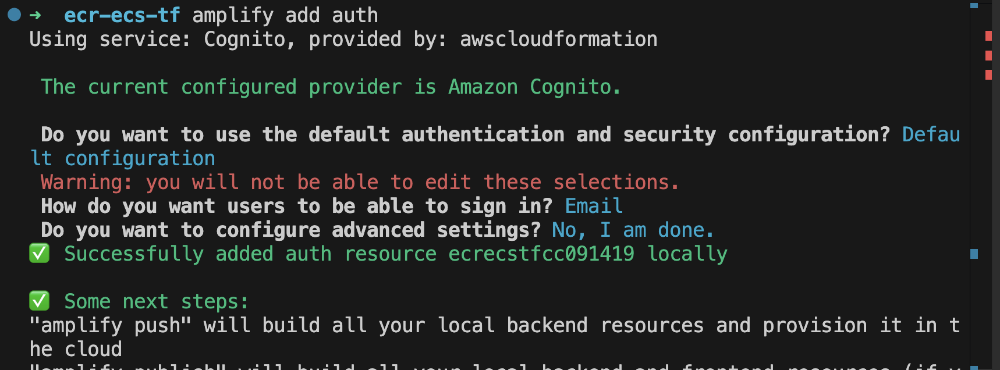
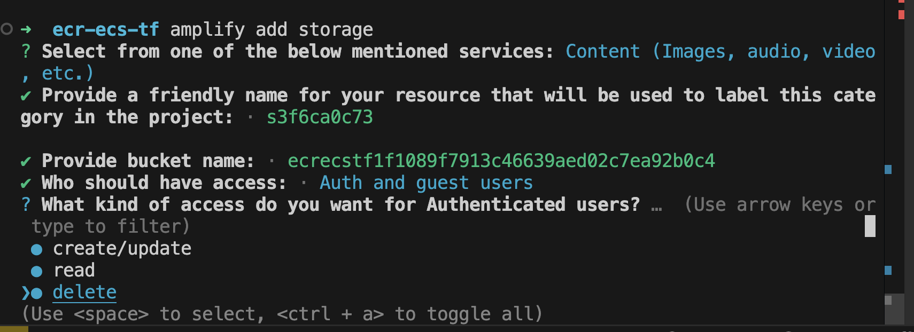

# Prepare and deploy the group chat application solution

The group chat application is comprised of six microservices:

- User service
- Group service
- User group service
- Message service
- Typing indicator service
- Read receipts service

Each microservice will have a corresponding App ID representation in Catalyst.

The services communicate asynchronously through publish-subscribe messaging using the Catalyst Pub/Sub API. The API is configured to use AWS SNS topics and AWS SQS subscriptions for the messaging infrastructure. The SNS/SQS topics and subscriptions are created on-demand by Catalyst, therefore no upfront infra deployment is required.

In addition, each service is instrumented to use the Catalyst State API for managing application state. The State API is configured to use AWS Dynamo DB.


## Solution structure

The `.github` folder contains a Github Actions pipeline setup to automate the
creation and configuration of all necessary Catalyst and AWS resources.

```bash
|catalyst-reference-apps
|-.github
   |--workflows
|-aws-pubsub
  |--cdk-graphql-stack(`realtime appsync api`)
  |--cdk-infra(`docker-ecr-ecs/fargate`)
  |--docs
  |--group-chat-app-ui
  |--services(Catalyst Apps)
|-group-subs.yaml
|-readme.md
```

The Github workflow includes three stages:

### 1. configure-diagrid-resources

The first stage of the pipeline deploys everything your application needs to interact with the Catalyst APIs. This includes:

- Creating six App IDs, one for each microservice in the group chat application
- Creating an AWS Dynamo DB instance and the respective state components for each Catalyst App
- Creating an AWS SNS/SQS Pub/Sub component
- Creating Pub/Sub topic subscriptions to ensure the Catalyst apps can publish and/or subscribe to messages

### 2. upload-to-ecs

The second stage of the pipeline deploys each application service to AWS Elastic Container Service using the AWS CDK with the approriate Catalyst environment variables configured. This includes:

- Retrieving the Catalyst project configuration settings such as:
  - `DAPR_API_TOKEN` for each catalyst app
  - `DAPR_HTTP_ENDPOINT` and `DAPR_GRPC_ENDPOINT`

- Uploading docker images for each service to AWS Elastic Container Registry (ECR)

- Installing a CDK project alongside some dependencies

- Creating AWS resources such as:  
  - A Virtual Private Cloud (VPC) configuration with subnets, availability zones and VPC Logs for an ECS cluster
  - An AWS Elastic Container Service (ECS) cluster
  - Fargate applications with associated Application Load Balancers (ALB)

- Configuring Catalyst App Endpoints by retrieving the ALB endpoints for each fargate instance and adding them to their respective Catalyst App IDs.

### 3. deploy-graphql-cdk-stack

The third stage of the pipeline deploys each application service to AWS Elastic Container Service using the AWS CDK with the approriate Catalyst environment variables configured. This includes:

- Installs CDK and accompanying dependencies.
- Retrieves the ALB DNS for each service and passes them as a JSON file to a CDK
  project
- Deploys the CDK Project and generates an endpoint which can be used to perform
  `query`, `mutation` and `subscription` operations on the underlying data

The generated endpoint will also be used to configure the frontend amplify application, which will be covered later on.

## Preparing the pipeline

In order to deploy Catalyst resources from the pipeline, you will need a Catalyst project & a generated API token. 

1. Login to Catalyst

    ```bash
    diagrid login
    ```

1. Set the appropriate Diagrid organization if you have more than one

    ```bash
    diagrid orgs use [your-org-name]
    ```

1. Select a unique project name for your Catalyst project 

    ```bash
    export DIAGRID_PROJECT="group-chat-app"
    ```

1. Create a Catalyst project

    ```bash
    diagrid project create $DIAGRID_PROJECT
    ```

1. Create a Catalyst project

    ```bash
    diagrid project use $DIAGRID_PROJECT
    ```

1. Create an API key which can be used by the pipeline when making Catalyst management API commands and store in an environment variable

    ```bash
    diagrid apikey create --name catalyst-api-key --role  cra.diagrid:admin
    ```

    ```bash
    export CATALYST_API_KEY=[your-token-value]
    ```

## Deploying the solution

1. Create your own fork of this [repo](https://github.com/diagrid-labs/catalyst-reference-apps/tree/main).
1. Navigate to the `Settings` menu within your fork.
  
1. Select `Secrets and Variables` from the left-hand menu.
  
1. Click on `Actions`.
1. Select `New repository secret` and add the following sensitive values:
    - AWS_ACCESS_KEY_ID
    - AWS_SECRET_ACCESS_KEY
    - AWS_ACCOUNT_ID
    - AWS_DEFAULT_REGION
    - DIAGRID_API_KEY
1. Select `new respository variable` and add the following values
    - AWS_DEFAULT_REGION
    - DIAGRID_PROJECT

Once you're ready, run the pipeline. If the everything is configured properly, your workflow should run to completion successfully.

### Deploying the UI using AWS Amplify

1. Navigate to the directory, `../aws-pubsub/group-chat-app-ui/`, and run the following:

    ```bash
    npm install -g @aws-amplify/cli
    npm i
    ```

1. Sign in to the AWS console and navigate to the `AWS AppSync` resource using the search function.
    
  
1. Find the codegen instructions in the middle of the project page. Copy the command and run in the root directory of your frontend solution.
  

[TODO: Insert picture for expected inputs]

1. Initialize a new amplify application which will generate an `amplifyconfig.js` file.

    ```bash
    amplify init 
    ```

[TODO: Insert picture for expected inputs]

1. Select `groupChatApp`, select `Settings` in the left-hand side bar, and copy the following details:
    
    [TODO: add screenshot with highlights]

    ```json
        "aws_appsync_graphqlEndpoint": [GRAPHQL_ENDPOINT],
        "aws_appsync_region": "us-east-1",
        "aws_appsync_authenticationType": "API_KEY",
        "aws_appsync_apiKey": "da2-**************",
    ```

1. Navigate to the directory `../aws-pubsub/group-chat-app-ui/src`. Open up the file `amplifyconfig.json` and add the key-value pairs you just retrieved to top of the file.

> NOTE: This configuration allows the amplify applicaiton to access the GraphQL API

   ```json

      {
        "aws_project_region": "us-east-1",
        "aws_appsync_graphqlEndpoint": "https:******",
        "aws_appsync_region": "us-east-1",
        "aws_appsync_authenticationType": "API_KEY",
        "aws_appsync_apiKey": "da2-********",
        "aws_cognito_identity_pool_id": "us-east-1:627cb5d3-ecaf-4fa1-a754-545144620488",
        "aws_cognito_region": "us-east-1",
        "aws_user_pools_id": "us-east-1_ak4Wv1FF4",
        "aws_user_pools_web_client_id": "4heoc8i46cacpm6nimj564hd23",
        "oauth": {},
        "aws_cognito_username_attributes": ["EMAIL"],
        "aws_cognito_social_providers": [],
        "aws_cognito_signup_attributes": ["EMAIL"],
        "aws_cognito_mfa_configuration": "OFF",
        "aws_cognito_mfa_types": ["SMS"],
        "aws_cognito_password_protection_settings": {
          "passwordPolicyMinLength": 8,
          "passwordPolicyCharacters": []
        },
        "aws_cognito_verification_mechanisms": ["EMAIL"],
        "aws_user_files_s3_bucket": "groupchatappui74fbc3d555e14d0ca57de2498f65e17b86d11-dev",
        "aws_user_files_s3_bucket_region": "us-east-1"
      }
   ```

1. Add Auth and Storage

    Run the command `amplify add auth` and follow the prompts. Please view the
    screenshot below

    

    Run the command `amplify add storage` and follow the prompts as show on the
    screenshot.

    

1. Run the command `amplify push` to create the Amplify cloud resource dependencies.

1. Finally, Run the application locally using the command `npm run dev`.

    > Tip: Follow this [guide](https://docs.amplify.aws/vue/start/quickstart/) to deploy the fronetend amplify application to the cloud.
